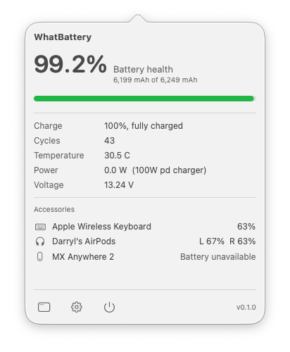

# WhatBattery

> **What is my battery's true health, and how much power is it really using?**

**Website: [whatbattery.app](https://www.whatbattery.app)** (overview, screenshots, and Pro details)

A small macOS menu bar app that shows the real health of your battery, the live power going in and out, and the service condition macOS uses, for your Mac and any iPhone or iPad you connect to it.

System Settings rounds battery health to a whole number and hides almost everything else. WhatBattery reads the same data Apple does, straight from IOKit and the SMC, and shows you the real maximum capacity, the cycle count, the live watts in and out, the temperature, and whether the battery actually needs service. No rounding, no guessing.

[](https://github.com/darrylmorley/whatbattery/releases/latest)
[](https://github.com/darrylmorley/whatbattery)
[](LICENSE)
[](https://www.whatbattery.app/#pro)



## What it shows

For your Mac, in the menu bar dropdown and the main window:

- **True battery health:** the real maximum capacity and cycle count, computed from the raw mAh figures (`NominalChargeCapacity / DesignCapacity`), not the rounded number macOS shows. Health is shown to one decimal, so a worn battery can't hide as "100%".
- **Live power:** watts in and out in real time, taken from the SMC power rail rather than the stale fuel-gauge reading, plus the charger your Mac negotiated, the voltage, and the temperature.
- **Service condition:** the same Normal / Service Recommended / Service Battery verdict macOS uses, read from the system so it matches System Settings.
- **Device detail:** marketing model name ("MacBook Pro (14-inch, M5)"), model identifier, regulatory model number, chip, serial, and Low Power Mode status, alongside the battery serial and adapter.

For a connected **iPhone or iPad** (Pro):

- The same health, cycle count, charge, temperature, voltage, and live power, read straight from the device over a cable or Wi-Fi, with no app installed on the device. It uses the same battery node and the same health math as the Mac.

Click the **gear icon** in the dropdown to open Settings, where you can enter a Pro licence key and configure threshold notifications.

## WhatBattery Pro

WhatBattery is free and open source. The free app shows battery health, live power, and the service condition for your Mac. [WhatBattery Pro](https://www.whatbattery.app/#pro) unlocks the long-term and multi-device features:

- **Lifetime Analyzer:** a live history of charge, temperature, voltage, and power, with charts and min/avg/max stats over a selectable range.
- **iPhone and iPad battery:** read the health and cycle count of a connected device straight from your Mac, over USB or Wi-Fi.
- **Battery Health History:** a long-term, per-device record of monthly health and cycles, for your Mac and every device you connect, kept for years, with backup and restore.
- **Reports and export:** a one-page battery report as PDF or print, and CSV / JSON export of your logged history, for warranty claims, resale, or your own records.
- **Threshold notifications:** alerts for charge high/low, temperature, and health milestones.

One-time purchase, works on up to 2 Macs. See [whatbattery.app](https://www.whatbattery.app/#pro) for details.

[](https://www.whatbattery.app/#pro)

## Install

Visit [whatbattery.app](https://www.whatbattery.app) for an overview and screenshots, or install directly below.

Download the latest `WhatBattery.zip` from the [Releases page](https://github.com/darrylmorley/whatbattery/releases/latest), unzip, and drag `WhatBattery.app` to `/Applications`.

The app is signed with a Developer ID and notarised by Apple, so there are no Gatekeeper warnings.

It's not on the Mac App Store on purpose: App Sandbox blocks the low-level IOKit and SMC reads WhatBattery depends on, and reading a connected iPhone or iPad uses a private framework that the store doesn't allow, so it ships signed and notarised outside the store instead.

Requires macOS 14 (Sonoma) or later, Apple Silicon only. Intel support is feasible later (AppleSmartBattery and the SMC exist on Intel too) but is out of scope for now.

> **Note:** the manual install gives you the menu bar app. A `whatbattery` CLI is bundled inside the `.app` at `WhatBattery.app/Contents/Helpers/whatbattery` and is not on your PATH by default. Install via Homebrew to get the CLI set up automatically, or symlink it yourself (see below).

### Homebrew

```bash
brew install --cask darrylmorley/whatbattery/whatbattery
```

This installs the menu bar app and symlinks the `whatbattery` CLI into your PATH.

## Command-line interface

A `whatbattery` binary ships alongside the menu bar app, driven by the same reader:

```text
$ whatbattery

Model         MacBook Pro (14-inch, M5)
Health        99.6% (6,225 / 6,249 mAh)
Charge        100%, fully charged
Cycles        42 (design 1000)
Temperature   30.4 C
Power         0.0 W  (100W pd charger)
Voltage       13.21 V
```

Flags:

```bash
whatbattery                # human-readable battery summary
whatbattery --json         # structured JSON, pipe into jq
whatbattery --watch        # live, refreshes as values change (Ctrl+C to exit)
whatbattery --idevice      # read a connected iPhone / iPad's battery (Pro)
whatbattery --version
whatbattery --help
```

Pro from the command line:

```bash
whatbattery --report                       # Pro: one-page battery report (current + lifetime)
whatbattery --export csv --range month     # Pro: export logged history (csv|json, week|month|year|all)
whatbattery --activate XXXX-XXXX-XXXX-XXXX # validate and store a Pro licence
whatbattery --licence                      # show current licence status
whatbattery --deactivate                   # remove the stored licence
whatbattery --pro                          # show Pro features, open purchase page
```

If you installed the `.app` manually rather than via Homebrew, symlink the CLI into your PATH:

```bash
ln -s /Applications/WhatBattery.app/Contents/Helpers/whatbattery /usr/local/bin/whatbattery
```

## How it works

WhatBattery reads from Apple's own interfaces. No entitlements, no kernel extension, no helper daemon, and it never writes to the battery or changes charging behaviour:

| Source | What it gives us |
| --- | --- |
| `AppleSmartBattery` (IOKit) | Raw charge capacity, design capacity, cycle count, voltage, temperature, and adapter info. Health is computed from `NominalChargeCapacity / DesignCapacity` (on Apple Silicon `MaxCapacity` is a pinned percentage, so it is never used). |
| SMC power rails | Live power in and out: `PPBR` for the live battery rail (the fuel-gauge `BatteryPower` sits stale on Apple Silicon), `VD0R / ID0R / PDTR` for DC-in. Read-only; degrades to nil if the SMC open is refused. |
| `system_profiler SPPowerDataType` | The battery "Condition" line, which matches System Settings. The IOPowerSources `BatteryHealth` key is not used: it reported "Check Battery" on a healthy battery, so it is unreliable. |
| `IODeviceTree` / `IOPlatformExpertDevice` / `sysctl` | Marketing model name, regulatory model number, model identifier, chip, and serial. |
| `MobileDevice.framework` diagnostics relay | For a connected iPhone or iPad, the device's `AppleSmartBattery` node over the lockdown relay (the same path Finder and Xcode use), mapped through the same health math as the Mac. |

## Build from source

```bash
swift build                  # compile everything
swift run WhatBattery         # run the menu bar app (dev mode, no widget or bundle structure)
swift run whatbattery-cli     # run the CLI
swift test                    # run the test suite
```

Requires Swift 5.9+ (Xcode 15+). `swift run WhatBattery` launches a working dev build, but without the widget extension or a proper `.app` bundle. For a distributable build, use the scripts below.

## Build a distributable .app

```bash
./scripts/smoke-test.sh
```

Builds, assembles a real `WhatBattery.app` (menu bar binary + CLI in `Helpers/` + embedded widget), signs, notarises (if configured), and runs an alive-after-2s check plus CLI `--version` / `--json` checks. Produces `dist/WhatBattery.app`. A real bundle is required for the menu bar app and notifications.

**Modes:**

| Configuration | Result |
| --- | --- |
| No `.env` | Ad-hoc signed. Works locally; Gatekeeper warns on other Macs. |
| `.env` with `DEVELOPER_ID` | Developer ID signed + hardened runtime. |
| `.env` with `DEVELOPER_ID` + `NOTARY_PROFILE` | Full notarisation + stapled ticket. Gatekeeper-clean for everyone. |

**Cutting a release:**

```bash
# write release-notes/v<version>.md first, then:
./scripts/release.sh <version>
```

The wrapper runs the whole pipeline: bumps the version, builds, signs, notarises, smoke-tests, bumps the local cask, tags and pushes, creates the GitHub release, verifies the uploaded asset's sha, and updates the Homebrew tap. Use `--dry-run` first. Requires `gh` (auth'd) and the env vars from `.env.example`.

## Caveats

- **Apple Silicon only, for now.** WhatBattery targets M1 and later on macOS 14+. Intel is feasible later but unsupported today.
- **Reading an iPhone or iPad needs a one-time trust.** Connect the device with a cable and tap Trust once; after that it can be read over USB or Wi-Fi. The diagnostics relay it uses is a private, undocumented interface whose keys can change between iOS versions, so WhatBattery validates the data it reads and shows a "battery not readable" state rather than bogus numbers if a future iOS changes the fields.
- **No genuine / counterfeit verdict.** There is no public signal that reliably distinguishes a genuine battery on a genuine machine, so WhatBattery shows the trustworthy service condition instead of guessing.
- **Pack manufacturer and manufacture date are not shown.** macOS itself exposes neither cleanly, and the raw blobs don't map to a value we can trust, so they're left out rather than shown wrong.

## Privacy

WhatBattery reads battery and power data locally from your Mac (and from a connected iPhone or iPad over the cable or Wi-Fi). None of it is sent anywhere automatically.

- **No analytics, no telemetry.** The app reads local battery data and nothing else.
- **Licence check:** the only network request is a one-time licence validation when you activate Pro.
- **Update checks:** WhatBattery checks the GitHub Releases API for a newer version. No personal data or hardware info is included.

## Contributing

Issues and PRs welcome. The code is small and tries to stay readable.

| Module | Role |
| --- | --- |
| [`Sources/WhatBattery/`](Sources/WhatBattery/) | Menu bar app UI (SwiftUI dropdown, main window, settings pane) |
| [`Sources/WhatBatteryCore/`](Sources/WhatBatteryCore/) | Pure Swift: battery models, health math, and formatters. No IOKit. |
| [`Sources/WhatBatteryDarwinBackend/`](Sources/WhatBatteryDarwinBackend/) | All IOKit / SMC: AppleSmartBattery reader, SMC power reader, system info, iDevice bridge |
| [`Sources/WhatBatteryAppKit/`](Sources/WhatBatteryAppKit/) | Plugin registry and extension points (hooks for Pro features, CLI commands, menu items) |
| [`Sources/WhatBatteryWidget/`](Sources/WhatBatteryWidget/) | WidgetKit extension (desktop widget) |
| [`Sources/WhatBatteryCLI/`](Sources/WhatBatteryCLI/) | CLI binary, shares Core / Backend with the app |

## Credits

Built by [Darryl Morley](https://github.com/darrylmorley), maker of [WhatCable](https://www.whatcable.uk) and [WhatPort](https://www.whatport.app).

The `AppleSmartBattery` and SMC readers are focused copies of the battery code already shipping in WhatCable.
